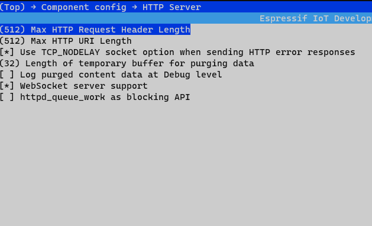
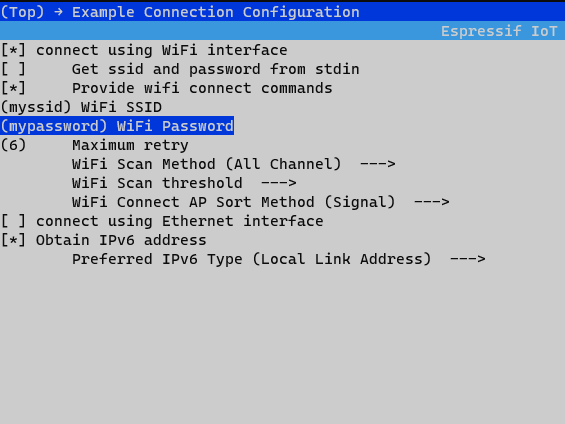
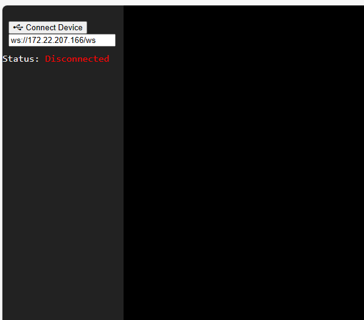
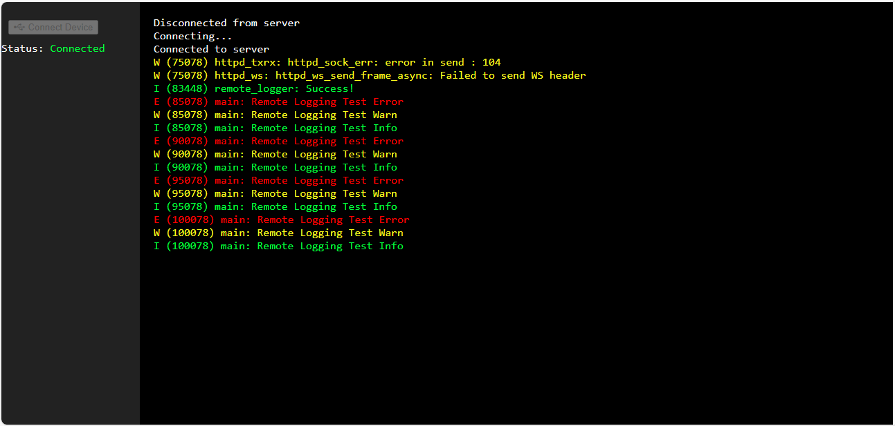

# Introduction
This is a minimal ESP-IDF component for network logging for debugging ESP32 microcontrolllers. It redirects the log output from UART0 to a WebSocket connection when it rendered on a web UI that looks like a command-line. It automatically takes care of redirecting the logging to UART0 when the remote client disconnets. 

# Target Framework and Device
ESP-IDF and ESP32 family of microchips (written entirely in C and  easily adaptable to work on other platforms)

## Logging Levels Supported
- Info (ESP_LOGI())
- Error (ESP_LOGE())
- Warning (ESP_LOGW())

# Setup 
## Adding the component to your project
There are a couple of ways you can include the component in your project. 
1. Place it in the `components` directory on the same level as your `main` so that the build system automatically discovers it. 
```
        project-root/
        │
        ├── components
        ├── main
        ├── CMakeLists.txt
        └── README.md
```

2. Point the build system to the directory where it resides using the `EXTRA_COMPONENT_DIRS` variable in your root CMakeLists.txt
```
set(EXTRA_COMPONENT_DIRS $ENV{IDF_PATH}/your/path/to/logger)
```

## Starting the logger in your code 
The following boilerplate must be present in your application code to configure the interfaces properly before starting the logger. 
```
    ESP_ERROR_CHECK(nvs_flash_init());
    ESP_ERROR_CHECK(esp_netif_init());
    ESP_ERROR_CHECK(esp_event_loop_create_default());

    ESP_ERROR_CHECK(example_connect()); (or setup Wi-Fi)
```
 
In your application code, call:
```
    start_remote_logger();
```

Enable WebSocket over HTTP in menuconfig before building, 
```
menuconfig -> Component Config -> HTTP Server -> Websocket Server Support
```


- Set connection parameters 
```
menuconfig -> Example Configuration
```

 

# Running

- If building your own frontend application, it should connect to the ESP32 over WebSocket and send the string "log" after handshake to begin recieving logs. 
- If using the application bundled with the component, enter the IP address of the ESP32 from the left pane and "Enter".  



# Sample Serial Monitor Output
```
I (768) example_connect: Connecting to GITAM...
I (778) example_connect: Waiting for IP(s)
I (3188) wifi:new:<11,0>, old:<1,0>, ap:<255,255>, sta:<11,0>, prof:1
I (3428) wifi:state: init -> auth (b0)
I (3448) wifi:state: auth -> assoc (0)
I (3458) wifi:state: assoc -> run (10)
I (3518) wifi:connected with GITAM, aid = 1, channel 11, BW20, bssid = 6c:8d:77:5d:98:a3
I (3518) wifi:security: WPA2-PSK, phy: bgn, rssi: -80
I (3518) wifi:pm start, type: 1

I (3548) wifi:AP's beacon interval = 102400 us, DTIM period = 1
I (3558) wifi:<ba-add>idx:0 (ifx:0, 6c:8d:77:5d:98:a3), tid:6, ssn:2, winSize:64
I (4588) example_connect: Got IPv6 event: Interface "example_netif_sta" address: fe80:0000:0000:0000:26dc:c3ff:fed1:53e8, type: ESP_IP6_ADDR_IS_LINK_LOCAL
I (5028) esp_netif_handlers: example_netif_sta ip: 172.22.207.166, mask: 255.255.240.0, gw: 172.22.192.1
I (5028) example_connect: Got IPv4 event: Interface "example_netif_sta" address: 172.22.207.166
I (5038) example_common: Connected to example_netif_sta
I (5038) example_common: - IPv4 address: 172.22.207.166,
I (5048) example_common: - IPv6 address: fe80:0000:0000:0000:26dc:c3ff:fed1:53e8, type: ESP_IP6_ADDR_IS_LINK_LOCAL
I (5058) remote_logger: Starting server on port: '80'
I (5068) remote_logger: Registering URI handlers
E (5068) main: Remote Logging Test Error
W (5068) main: Remote Logging Test Warn
I (5078) main: Remote Logging Test Info
E (10078) main: Remote Logging Test Error
W (10078) main: Remote Logging Test Warn
I (10078) main: Remote Logging Test Info
I (10668) remote_logger: Handshake done,  new connection opened
I (10678) remote_logger: Redirecting Logging To WebSocket
W (75078) remote_logger: Client disconnected. Logging redirected to UART0
W (75078) main: Remote Logging Test Warn
I (75078) main: Remote Logging Test Info
E (80078) main: Remote Logging Test Error
W (80078) main: Remote Logging Test Warn
I (80078) main: Remote Logging Test Info
I (83438) remote_logger: Handshake done,  new connection opened
I (83448) remote_logger: Redirecting Logging To WebSocket
```
# Sample Web Logging Output
